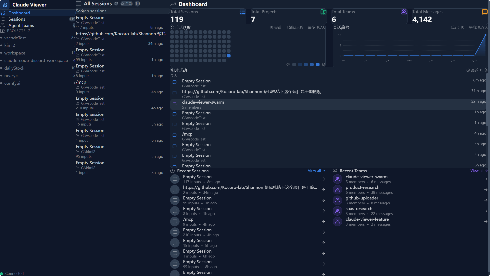

# Claude Viewer

**English** | [中文](#简介)

An integrated monitoring dashboard for Claude Code Sessions and Agent Teams.

> **Vibe Coding** by [Kimi 2.5](https://www.kimi.com)



## Features

- **Dashboard**: Overview with activity heatmap, trend charts, and real-time timeline
- **Sessions**: Browse, search, and manage all conversation sessions
  - Custom naming and starring
  - Tag system with filtering
  - Batch operations (delete, export)
  - Smart filter bar with saved filters
  - One-click open in Claude Code / VS Code (see [VSCode Plugin](#vscode-plugin))
  - Mobile-friendly touch interface
- **Projects**: Organize sessions by project
- **Teams**: Monitor Agent Teams and member messages
  - Real-time message updates
  - Member status indicators
  - Team starring
- **Themes**: Dark, Eye Care (warm), and Light Eye Care modes
- **Languages**: Chinese and English interface
- **Command Palette**: `Cmd/Ctrl + K` quick actions
- **Deep Links**: Shareable URL hashes

## Quick Start

### Requirements
- Node.js >= 18.0.0
- npm >= 9.0.0

### Install
```bash
npm run install:all
```

### Run
```bash
npm run dev
```

Frontend: http://localhost:5173
Backend: http://localhost:13927

### Mobile Access
Access via Tailscale or local network for mobile devices:
```
http://<your-ip>:5173
```

**Mobile Features:**
- Touch-optimized session list with always-visible actions
- Bottom navigation bar for easy switching
- Swipe gestures for quick actions (favorite/delete)
- Responsive layout adapts to screen size
- Pull-to-refresh support

### Build
```bash
npm run build
```

### Test
```bash
cd backend && npm test
cd ../frontend && npm test
```

## Project Structure

```
claude-viewer/
├── backend/          # Node.js + Express + Socket.io
│   ├── src/routes/   # API endpoints
│   └── src/services/ # Business logic
└── frontend/         # React + TypeScript + Vite
    ├── src/components/
    ├── src/contexts/ # Theme, I18n
    └── src/styles/themes/  # Theme system
```

## Themes

| Theme | ID | Description |
|-------|-----|-------------|
| Dark | `dark` | Deep blue-gray, high contrast |
| Eye Care | `eyeCare` | Warm sepia tones |
| Light Eye Care | `lightEyeCare` | Light warm cream |

Switch via sidebar bottom buttons or `Cmd/Ctrl + K`.

## VSCode Plugin

The "Open in VSCode" feature requires the [VSCode Claude Code Launcher](https://github.com/nearyc/vscode-claude-code-launcher) plugin to be installed.

- **Install from GitHub**: https://github.com/nearyc/vscode-claude-code-launcher

This plugin enables deep linking from Claude Viewer to VSCode, allowing you to:
- Open sessions directly in VSCode with Claude Code
- Auto-resume specific sessions
- Navigate to the correct project directory

## API

| Method | Path | Description |
|--------|------|-------------|
| GET | /api/sessions | List sessions |
| GET | /api/sessions/:id | Session detail |
| DELETE | /api/sessions/:id | Delete session |
| GET | /api/teams | List teams |
| GET | /api/teams/:id/messages | Team messages |
| GET | /api/stats/activity | Heatmap data |

## Tech Stack

- **Frontend**: React 19 + TypeScript + Vite + Tailwind CSS + Socket.io
- **Backend**: Node.js + Express + Socket.io + TypeScript
- **Real-time**: WebSocket (Socket.io)
- **Storage**: File system (JSONL/JSON)

---

# 简介

**中文** | [English](#claude-viewer)

Claude Viewer 是一个集成的监控面板，用于查看 Claude Code 的 Sessions 和 Agent Teams 数据。

> **Vibe Coding** by [Kimi 2.5](https://www.kimi.com)

## 功能特性

- **仪表盘**: 包含活动热力图、趋势图和实时时间线
- **会话**: 浏览、搜索和管理所有对话会话
  - 自定义命名与收藏
  - 标签系统与筛选
  - 批量操作（删除、导出）
  - 智能筛选栏与保存的筛选条件
  - 一键在 Claude Code / VS Code 中打开（需安装 [VSCode 插件](#vscode-插件)）
  - 移动端友好的触摸界面
- **项目**: 按项目组织会话
- **团队**: 监控 Agent Teams 和成员消息
  - 实时消息更新
  - 成员状态指示器
  - 团队收藏
- **主题**: 深色、护眼（暖色调）、浅色护眼三种模式
- **语言**: 中文和英文界面
- **命令面板**: `Cmd/Ctrl + K` 快捷操作
- **深度链接**: 可分享的 URL 哈希

## 快速开始

### 环境要求
- Node.js >= 18.0.0
- npm >= 9.0.0

### 安装
```bash
npm run install:all
```

### 启动
```bash
npm run dev
```

前端: http://localhost:5173
后端: http://localhost:13927

### 移动端访问
通过 Tailscale 或局域网在移动设备上访问：
```
http://<你的IP>:5173
```

**移动端特性：**
- 触摸优化的会话列表，操作按钮始终可见
- 底部导航栏，方便快速切换
- 滑动手势快速操作（收藏/删除）
- 自适应屏幕尺寸的响应式布局
- 支持下拉刷新

### 构建
```bash
npm run build
```

### 测试
```bash
cd backend && npm test
cd ../frontend && npm test
```

## 项目结构

```
claude-viewer/
├── backend/          # Node.js + Express + Socket.io
│   ├── src/routes/   # API 接口
│   └── src/services/ # 业务逻辑
└── frontend/         # React + TypeScript + Vite
    ├── src/components/
    ├── src/contexts/ # 主题、国际化
    └── src/styles/themes/  # 主题系统
```

## 主题系统

| 主题 | ID | 描述 |
|-------|-----|------|
| 深色模式 | `dark` | 深蓝灰色背景，高对比度 |
| 护眼模式 | `eyeCare` | 暖色调背景 |
| 浅色护眼 | `lightEyeCare` | 浅色暖奶油色背景 |

通过左下角按钮或 `Cmd/Ctrl + K` 切换。

## VSCode 插件

"在 VSCode 中打开" 功能需要安装 [VSCode Claude Code Launcher](https://github.com/nearyc/vscode-claude-code-launcher) 插件。

- **从 GitHub 安装**: https://github.com/nearyc/vscode-claude-code-launcher

此插件支持从 Claude Viewer 直接跳转到 VSCode，实现以下功能：
- 在 VSCode 中直接使用 Claude Code 打开会话
- 自动恢复指定会话
- 自动导航到正确的项目目录

## API 接口

| 方法 | 路径 | 说明 |
|--------|------|------|
| GET | /api/sessions | 获取会话列表 |
| GET | /api/sessions/:id | 会话详情 |
| DELETE | /api/sessions/:id | 删除会话 |
| GET | /api/teams | 获取团队列表 |
| GET | /api/teams/:id/messages | 团队消息 |
| GET | /api/stats/activity | 热力图数据 |

## 技术栈

- **前端**: React 19 + TypeScript + Vite + Tailwind CSS + Socket.io
- **后端**: Node.js + Express + Socket.io + TypeScript
- **实时通信**: WebSocket (Socket.io)
- **数据存储**: 文件系统 (JSONL/JSON)

## License

MIT
